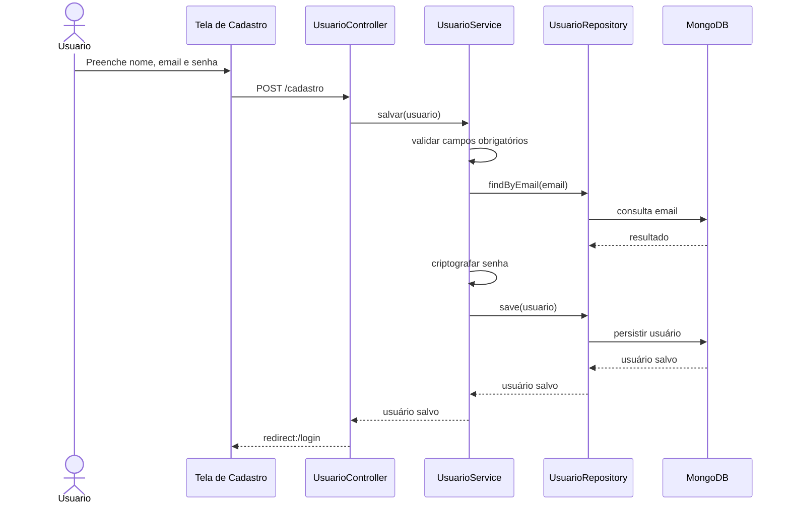
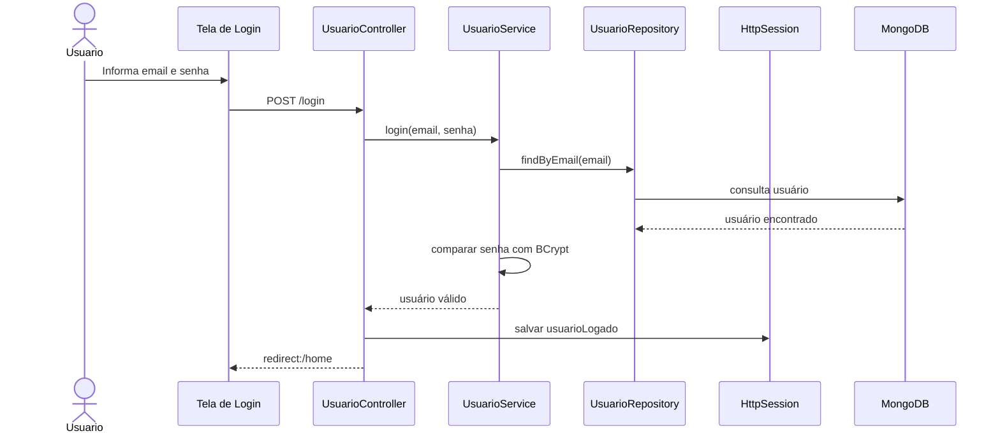
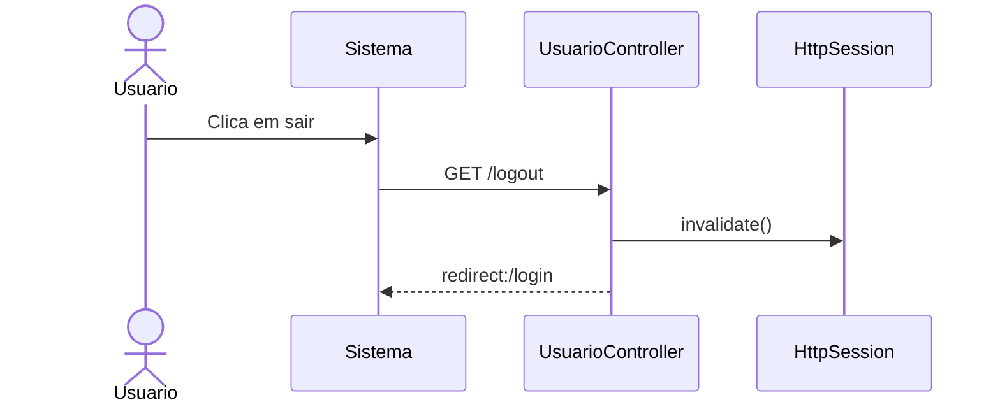
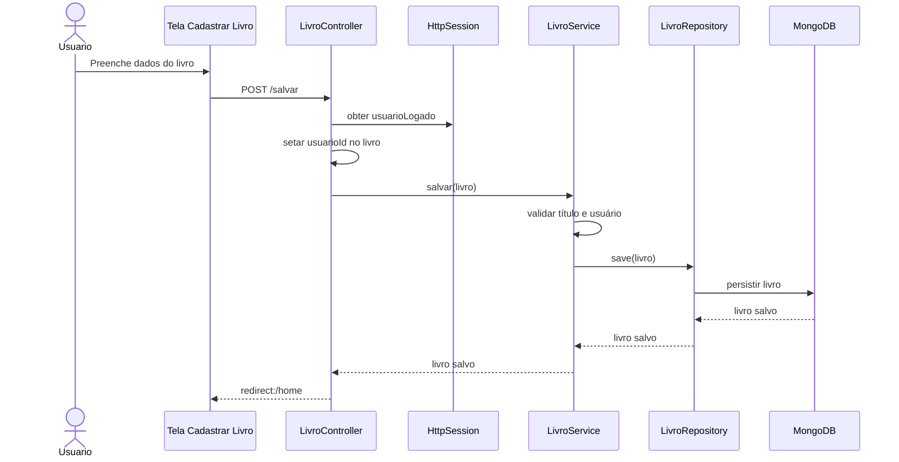
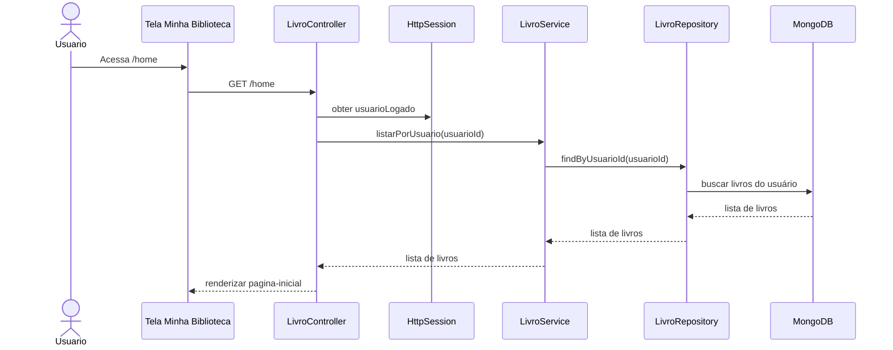
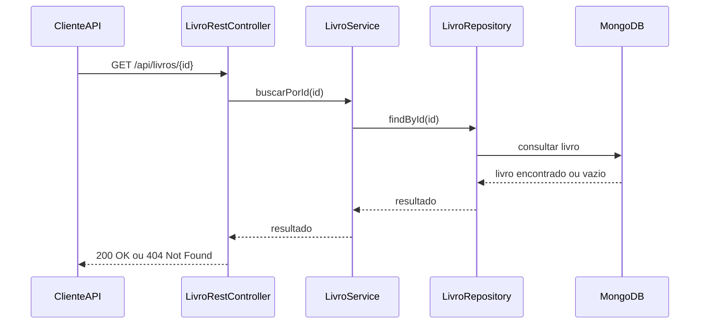
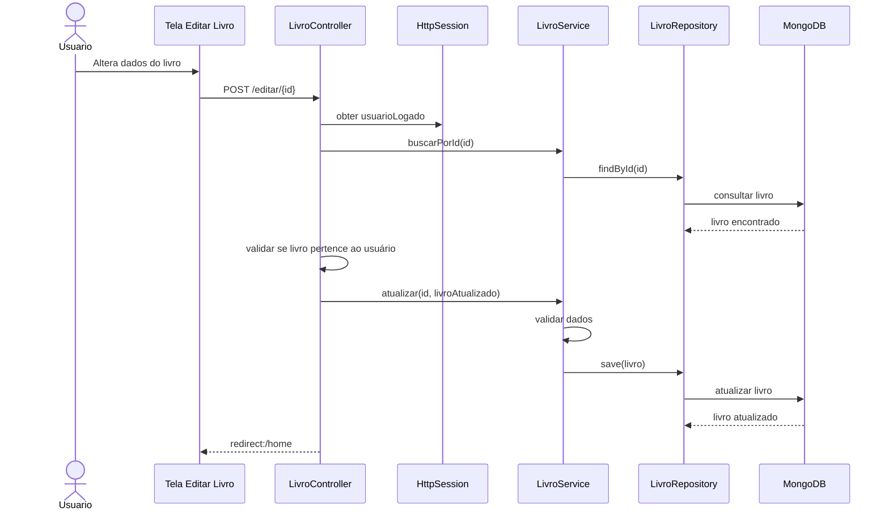
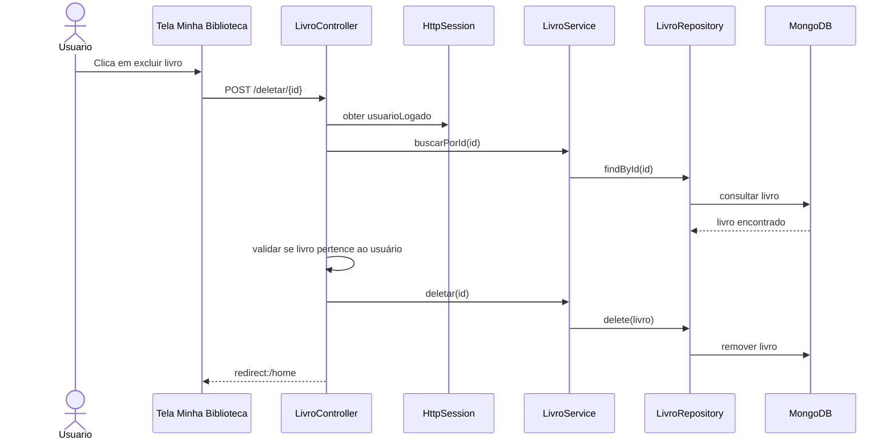
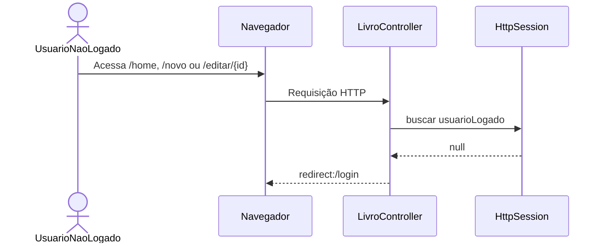
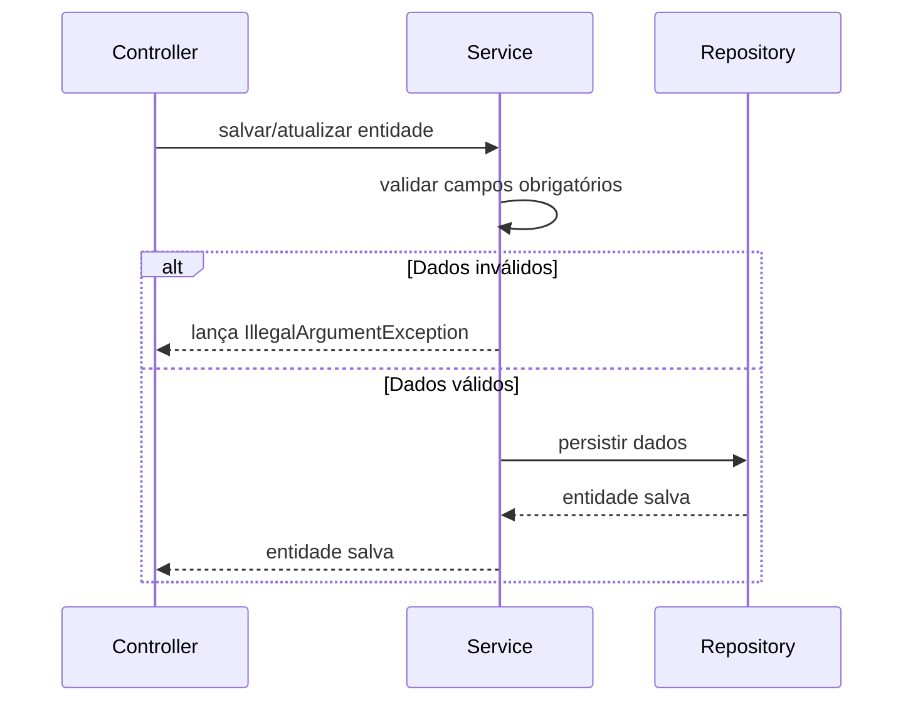

# RTM - Matriz de Rastreabilidade de Requisitos

Projeto: Gerenciador de Biblioteca Pessoal
Objetivo: mapear os requisitos funcionais aos testes automatizados e aos fluxos UML de sequência.

Cobertura atual do projeto: **97%**

---

# Tecnologias de Qualidade Utilizadas

- JUnit 5
- Spring Boot Test
- Testcontainers
- JaCoCo
- GitHub Actions
- SonarQube

---

# Matriz de Rastreabilidade

| ID   | Requisito Funcional                    | Implementação                                                                       | Testes Relacionados                                                                                                     | Tipo de Teste                                   | Status  |
| ---- | -------------------------------------- | ----------------------------------------------------------------------------------- | ----------------------------------------------------------------------------------------------------------------------- | ----------------------------------------------- | ------- |
| RF01 | Cadastrar usuário                      | `UsuarioController`, `UsuarioRestController`, `UsuarioService`, `UsuarioRepository` | `UsuarioControllerTest`, `UsuarioRestControllerTest`, `UsuarioServiceIntegrationTest`, `UsuarioServiceParametrizedTest` | Controller/E2E, REST, Integração, Parametrizado | Coberto |
| RF02 | Realizar login                         | `UsuarioController`, `UsuarioRestController`, `UsuarioService`                      | `UsuarioControllerTest`, `UsuarioRestControllerTest`, `UsuarioServiceIntegrationTest`, `UsuarioServiceParametrizedTest` | Controller/E2E, REST, Integração, Parametrizado | Coberto |
| RF03 | Realizar logout                        | `UsuarioController`                                                                 | `UsuarioControllerTest`                                                                                                 | Controller/E2E                                  | Coberto |
| RF04 | Cadastrar livro                        | `LivroController`, `LivroRestController`, `LivroService`, `LivroRepository`         | `LivroControllerTest`, `LivroRestControllerTest`, `LivroServiceIntegrationTest`, `LivroServiceParametrizedTest`         | Controller/E2E, REST, Integração, Parametrizado | Coberto |
| RF05 | Listar livros do usuário logado        | `LivroController`, `LivroRestController`, `LivroService`, `LivroRepository`         | `LivroControllerTest`, `LivroRestControllerTest`, `LivroServiceIntegrationTest`                                         | Controller/E2E, REST, Integração                | Coberto |
| RF06 | Buscar livro por ID                    | `LivroRestController`, `LivroService`, `LivroRepository`                            | `LivroRestControllerTest`, `LivroServiceIntegrationTest`                                                                | REST, Integração                                | Coberto |
| RF07 | Editar livro                           | `LivroController`, `LivroRestController`, `LivroService`                            | `LivroControllerTest`, `LivroRestControllerTest`, `LivroServiceIntegrationTest`                                         | Controller/E2E, REST, Integração                | Coberto |
| RF08 | Excluir livro                          | `LivroController`, `LivroRestController`, `LivroService`                            | `LivroControllerTest`, `LivroRestControllerTest`, `LivroServiceIntegrationTest`                                         | Controller/E2E, REST, Integração                | Coberto |
| RF09 | Impedir acesso à biblioteca sem sessão | `LivroController`                                                                   | `LivroControllerTest`                                                                                                   | Caixa Preta / E2E                               | Coberto |
| RF10 | Validar campos obrigatórios            | `UsuarioService`, `LivroService`                                                    | `UsuarioServiceParametrizedTest`, `LivroServiceParametrizedTest`                                                        | Parametrizado / Caixa Branca                    | Coberto |

---

# RF01 - Cadastro de Usuário

---

# RF02 - Login

---

# RF03 - Logout

---

# RF04 - Cadastro de Livro

---

# RF05 - Listagem de Livros do Usuário

---

# RF06 - Buscar Livro por ID

---

# RF07 - Editar Livro

---

# RF08 - Excluir Livro

---

# RF09 - Proteção de Rotas por Sessão

---

# RF10 - Validação de Campos Obrigatórios

